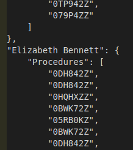

# Collaborative Filtering for Patient Recommendations

Image by [Moises Fermin on SkillsCommons](https://www.skillscommons.org/handle/taaccct/8679#) 

This code offers a generalizable collaborative filtering solution intended to improve the quality of care for patients. Using a JSON file containing data on patients and their histories of medical procedures the solution recommends N number of additional procedures for caregivers to consider.

To run the code call: python get_recs.py *file_name* *number_of_recommendations*
> python get_recs.py patient_data.json 5

For simplicity, the file should be saved in the same directory as the .py file.

Each patient's recommendations are written to a file named *datetime*_RECS_FOR-*file_name*
> 2020_9_17_1140_RECS_FOR-patient_data.json

The code relies on non-negative matrix factorization (NMF) to uncover and leverage latent factors from a patient-procedure matrix. NMF was selected after evaluating a number of other algorithms including KNN, SVD, and one that generates predictions based on (an assumed) normal distribution. Given the nature of the solution, it could be applied in a variety of contexts (e.g. other patients) and extended to new scenarios (e.g. book recommendations) however hyperparameter tuning and re-evaluation of the core algorithm would be ideal for the latter.

## NMF
NMF falls under the general category of matrix factorization techniques where a larger matrix is decomposed into smaller matrices. The decomposition unveils latent factors hidden in the data. While the true nature of these factors may be difficult to articulate they indicate attributes shared by items in the matrix (e.g. cardiovascular diseases).

## Surprise library
The Surprise library is a SciPy add-on package written in Python. It provides an experience similar to that of scikit-learn. Although, some interactions are different than what you might expect especially given the nuances in creating a train-test split for recommendation data. The [FAQ page](https://surprise.readthedocs.io/en/stable/FAQ.html) is a good reference.

## JSON file
The JSON file is expected to be in a simple format where the keys are *patient_name* and 'Procedures'. The value for 'Procedures' is a list of elements here, medical codes. A sample is shown below.

Changes can be made to load_json() to facilitate other files and structures.